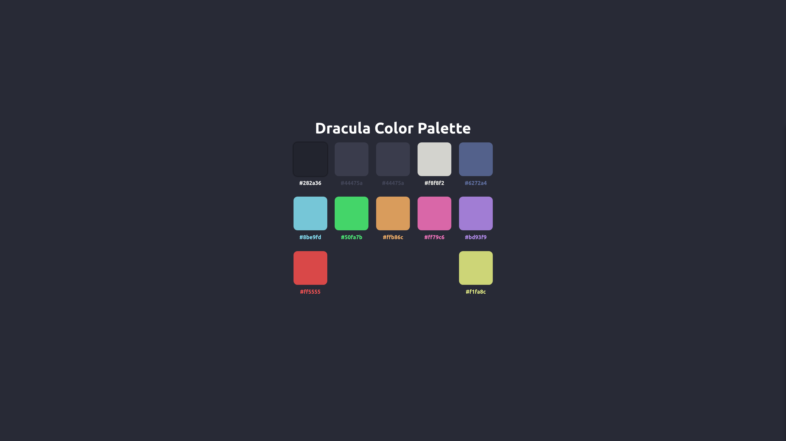

# Dracula Color Palette
 
## Info
Got tired of having to open up the dracula theme repo to grab the hex colors, so I made a app using react and react-copy-to-clipboard to display the dracula theme colors and add them to the clipboard when the color is clicked.
## Available Scripts

In the project directory, you can run:

### `npm start`

Runs the app in the development mode.\
Open [http://localhost:3000](http://localhost:3000) to view it in the browser.

The page will reload if you make edits.\
You will also see any lint errors in the console.

### Deployment `npm run deploy`

Deploys to github pages

